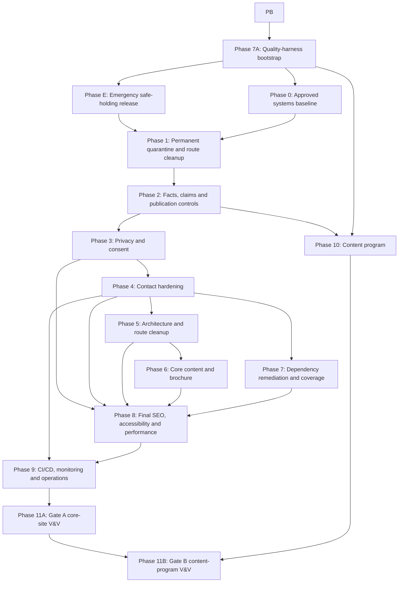

# The Caring Cove — Full Remediation Cursor Specification

| Field | Value |
|---|---|
| Document ID | TCC-SPEC-001 |
| Version | 1.2.0 |
| Date | 2026-08-17 |
| Status | Draft — implementation authorized; production release not authorized |
| Audit baseline | `main` at `3b4fc2b68ddf166087fc10f81977e01b0450317d` |
| Execution baseline | Bootstrap commit containing this spec, both audits and evidence manifest; record in `docs/audits/MANIFEST.json` |
| System owner | `[CONFIRM: accountable business owner]` |
| Clinical claims approver | `[CONFIRM: licensed/qualified reviewer]` |
| Privacy/legal approver | `[CONFIRM: Kenyan privacy/legal reviewer]` |
| Release authority | `[CONFIRM: person who can approve production deployment]` |
| Change authority | System owner; production deployment requires release authority |
| Source audits | `docs/audits/2026-08-17-systems-completeness-audit.md` and `docs/audits/2026-08-17-content-strategy-audit.md` |

## 0. Cursor execution directive

Treat this file as the controlling implementation specification. Execute it phase by phase. Do not reinterpret “fix all” as permission to invent facts, publish externally, deploy production, contact people, create testimonials, or waive unresolved clinical/privacy risks.

For every phase:

1. Read this entire specification, `AGENTS.md`, the files owned by the phase, and all upstream phase handoffs.
2. Confirm the current branch, SHA, working-tree state, Node/PHP versions, and applicable environment capabilities.
3. Create one focused branch and pull request per phase or defined subphase where GitHub authentication permits. If GitHub authentication is unavailable, commit locally only when explicitly requested.
4. Preserve unrelated user changes. Never reset or overwrite a dirty tree.
5. Implement tests with the change, run every listed verification command, and record exact output.
6. Update traceability, decisions, risks, and handoff documents before declaring the phase complete.
7. Stop at approval gates. `[CONFIRM]` values are not permission to guess.
8. A phase is not complete because code compiles. It is complete only when its exit criteria and evidence requirements pass.

### Required execution report for every phase

```text
Phase:
Branch and commit:
Files changed:
Requirements closed:
Tests added:
Commands run and results:
Evidence artifacts:
Open issues and owners:
Risks changed:
Rollback procedure:
Next unblocked phases:
```

## 1. Objective and success state

Transform the current static Next.js/cPanel website into a trustworthy, accessible, secure, measurable, maintainable healthcare marketing system that:

- publishes only approved, current, evidence-backed content;
- gives families clear paths from education to evaluation to a private-tour inquiry;
- handles personal and care-interest data truthfully and safely;
- has real tests, quality gates, monitoring, rollback, and operational ownership;
- supports a future searchable and shareable content program without exposing drafts;
- produces a reproducible static artifact and a verified release evidence packet.

The target is a safe core-site release first. The blog/content-program launch is a separate gate and must not delay removal of harmful placeholder content.

## 2. Non-goals and authority limits

- Do not deploy production or send test inquiries containing real personal or health data without explicit approval.
- Do not make legal conclusions. Implement approved legal copy and technical controls; record unresolved legal decisions.
- Do not invent staff, qualifications, licences, partnerships, addresses, prices, testimonials, outcomes, statistics, response times, operational capabilities, or medical claims.
- Do not retain fake content as “temporary” production content.
- Do not add a CMS until the content model and ownership workflow prove that one is necessary.
- Do not add a database merely to make the architecture look sophisticated.
- Do not claim live email delivery, analytics, consent, backups, rollback, or monitoring until exercised in the target environment.

## 3. Locked invariants

1. The deployable frontend remains a static Next.js export unless ADR-001 is approved.
2. The public site must fail closed: draft, expired, unsupported, or unapproved content never renders.
3. User-facing success means the inquiry transport has accepted the message; a client-side click is not success.
4. Logs, analytics, test fixtures, screenshots, and CI artifacts contain no real PII or health-interest data.
5. Every public clinical, operational, comparative, credential, outcome, pricing, availability, and response-time claim has an evidence record and approval state.
6. Unknown URLs return a real 404; they never return the homepage with HTTP 200.
7. No public control is decorative: search, forms, comments, social links, downloads, and CTAs either work or are removed.
8. Accessibility target is WCAG 2.2 AA for the website and accessible tagged PDF for the brochure.
9. The same built artifact promoted through staging is the artifact released to production.
10. Production release requires named human approval; technical green checks cannot waive owner, clinical, privacy, or legal gates.
11. Audit Blockers, privacy/legal duties, unsupported public claims, false inquiry success and Gate A safety controls cannot be waived. They may close only through verified remediation or evidence-backed non-applicability approved by the relevant independent authority.
12. Publication-state withdrawal on a static site is not immediate: it requires rebuild, approved promotion, remote-file reconciliation, cache handling and post-deploy route verification.

## 4. Baseline system context

### Stakeholders

- Prospective residents and family decision-makers in Kenya.
- Diaspora family members evaluating care remotely.
- Residents whose dignity, privacy, and representation may be affected.
- Intake and operations staff receiving inquiries.
- Clinical reviewers responsible for care claims.
- Business owner and release authority.
- Privacy/legal reviewer.
- Website maintainers.

### Current modules and external interfaces

| Source | Destination | Flow | Current medium | Required owner | Required verification |
|---|---|---|---|---|---|
| Visitor browser | Static site | Pages/assets | HTTPS via Apache/cPanel | Web owner | Browser/E2E/smoke |
| Visitor browser | Contact handler | Name, email, phone, care interest, location | multipart POST to PHP | Intake + privacy owner | Contract, abuse, delivery, privacy tests |
| Contact handler | Mailbox | Inquiry message | PHP `mail()` | Intake/infra owner | Authenticated live delivery and failure test |
| Visitor browser | Google Analytics | Usage/identifiers | `gtag` | Marketing + privacy owner | Consent and event validation |
| Visitor browser | WhatsApp/social/maps | Navigation to third party | HTTPS link | Marketing owner | Link and disclosure validation |
| GitHub Actions | cPanel | Static artifact + PHP | FTP | Release/infra owner | Staging, checksum, rollback drill |
| Maintainer | Content registry | Copy, claims, people, articles | Git-reviewed files | Editorial owner | Schema, publication, approval tests |

## 5. Audit remediation matrix

| ID | Finding | Severity | Owning phase | Closure evidence |
|---|---|---:|---:|---|
| AUD-001 | No privacy notice, consent record, retention/deletion contract, or approved health-interest handling | Blocker | 3 | Approved policy, consent tests, data-flow record |
| AUD-002 | GA loads before a consent decision | Blocker | 3 | Consent-mode E2E and network evidence |
| AUD-003 | Unsupported clinical/operational/comparative claims render publicly | Blocker | 2 | Claim registry + approver evidence + render tests |
| AUD-004 | Template IT service, team, blog, comments, testimonials and fake engagement content | Blocker | 1 | Quarantine scan and route tests |
| AUD-005 | 1:1 versus 1:4 model conflict | Blocker | 2 | Approved canonical fact and global consistency test |
| AUD-006 | Conflicting phone/address/personnel/brochure facts | Blocker | 2, 6 | Approved fact registry and artifact comparison |
| AUD-007 | Five high production-tree and ten total dependency advisories | Blocker | 7 | Clean approved audit or documented exception |
| AUD-008 | ESLint fails with four errors and 25 warnings | High | 7 | Zero-error/zero-warning CI lint |
| AUD-009 | No repository-owned unit, integration, E2E, accessibility or deployment tests | High | 7 | Required suites and coverage reports |
| AUD-010 | CI deploys after build only and uploads directly by FTP | High | 9 | Required quality workflow, promotion and rollback drill |
| AUD-011 | Contact CORS fails open; no rate limit; weak normalization; no reliable delivery evidence | Blocker | 4 | Negative contract suite + staging delivery evidence |
| AUD-012 | Unknown and policy routes return homepage HTTP 200 | High | 1, 8 | Real 404 and route status tests |
| AUD-013 | Static-export architecture conflicts with Node/Passenger scripts/docs | Medium | 5, 9 | Approved ADR and reconciled scripts/docs |
| AUD-014 | Internal strategy notes render as customer copy | High | 2, 6 | Content scan and editorial approval |
| AUD-015 | Care-guide CTA and multiple `#` controls are broken | High | 1, 6 | CTA destination test |
| AUD-016 | Pricing exists but is hidden and FAQ says it is not displayed | Medium | 2, 6 | Approved pricing decision and consistent copy |
| AUD-017 | Blog has no searchable/shareable content system | High | 10 | Publication schema, pillar map, approved launch set |
| AUD-018 | Numeric blog URLs, fake authors/comments/categories and no citations/review dates | High | 1, 10 | Quarantine then approved article schema |
| AUD-019 | Brochure is stale, image-only, untagged, inconsistent and inaccessible | High | 6 | Approved, tagged PDF and content parity test |
| AUD-020 | No requirements, interfaces, FMEA, risk/decision registers, V&V map or release checklist | High | 0, 11 | Accepted governance baseline |
| AUD-021 | No incident, recovery, monitoring, backup/restore, maintenance or degraded-mail runbooks | High | 9, 11 | Exercised runbooks and evidence |
| AUD-022 | Image/export size and unoptimized images threaten performance | Medium | 8 | Performance budgets and Lighthouse evidence |
| AUD-023 | No customer research, keyword data, conversion evidence or editorial workflow | Medium | 10 | Research intake, backlog and measurement contract |
| AUD-024 | Build root is inferred from parent lockfiles | Medium | 5 | Explicit Turbopack root and reproducible clean build |
| AUD-025 | Admissions/assessment journey lacks verified steps, boundaries, preparation and response expectations | High | 6 | Approved admissions path and journey tests |
| AUD-026 | Public media has no complete provenance, licence/model-release, consent-expiry or EXIF register | High | 2, 6 | Approved media-rights registry and withdrawal test |

## 6. Requirements baseline

### Publication and factual integrity

- **TCC-PUB-001:** The build shall exclude content whose publication state is not `approved`. [Must]
- **TCC-PUB-002:** The build shall fail when public content references an unknown, expired, rejected, or unapproved claim ID. [Must]
- **TCC-PUB-003:** The public site shall contain no placeholder names, lorem text, generic IT content, fabricated comments, fake testimonials, or dead controls. [Must]
- **TCC-PUB-004:** Every public person profile shall include an approved identity record, role, bio, image rights state, reviewer, approval date, and optional verified social links. [Must]
- **TCC-PUB-005:** All canonical business facts shall come from one typed registry. [Must]
- **TCC-PUB-006:** When an approved fact changes, all pages, metadata, schema, email responses, environment examples, and brochure source shall update from the same value or fail validation. [Must]
- **TCC-PUB-007:** Internal strategy fields shall never be part of the renderable content type. [Must]

### Content strategy and discoverability

- **TCC-CNT-001:** Every public page shall declare a primary audience, buyer stage, primary question, conversion action, owner, review date, and publication state. [Must]
- **TCC-CNT-002:** Every article shall be searchable, shareable, or both and shall state its intent in non-rendered metadata. [Must]
- **TCC-CNT-003:** Published articles shall use descriptive slugs, named authors, qualified reviewers where clinical content is present, published/updated dates, source citations, related-content links, and a relevant CTA. [Must]
- **TCC-CNT-004:** The pillar set approved through ADR-006 after research shall map to hubs, supporting topics and conversion paths without duplicating article intent. The five pillars in Phase 10 are proposals only. [Should]
- **TCC-CNT-005:** The content program shall not launch until a real, approved minimum launch set exists; otherwise the blog routes shall remain unpublished. [Must]
- **TCC-CNT-006:** The site shall provide an owner-approved admissions/assessment journey containing only verified steps, required information, eligibility boundaries, alternatives, response expectations and next actions. [Must]
- **TCC-CNT-007:** “Searchable” shall mean an indexable canonical resource matching a documented query intent; “shareable” shall mean a canonical Open Graph resource with an evidence-backed distribution hypothesis. Internal search is a separate feature and shall not be implied by either term. [Must]

### Privacy and inquiry handling

- **TCC-PRV-001:** Before submission, the form shall provide an approved privacy notice link, purpose statement, required/optional field labels, and affirmative acknowledgement where approved by counsel. [Must]
- **TCC-PRV-002:** The inquiry payload shall include the approved policy version and acknowledgement timestamp without collecting unrelated health detail. [Must]
- **TCC-PRV-003:** Analytics and non-essential storage shall remain disabled until the visitor’s consent choice permits them. [Must]
- **TCC-PRV-004:** Consent withdrawal shall be as easy as consent and shall persist across pages. [Must]
- **TCC-PRV-005:** The system shall document retention, deletion, access, processor, breach, and cross-border handling decisions. [Must]
- **TCC-PRV-006:** Every collected field shall have an approved necessity rationale; sensitive interest selection shall default blank/general, allow “prefer not to say,” and never infer a diagnosis from a default. [Must]
- **TCC-PRV-007:** Retention/deletion/access controls shall be configured and exercised with synthetic records across mailbox/provider, logs, exports and applicable backups; documentation alone is insufficient. [Must]
- **TCC-FRM-001:** If the handler cannot validate, rate-limit, and hand the inquiry to the approved transport, it shall return failure and the UI shall not claim receipt. [Must]
- **TCC-FRM-002:** The handler shall reject disallowed origins, unexpected fields, invalid enums, CR/LF injection, oversized bodies, malformed encodings, repeated abuse, and unsupported methods. [Must]
- **TCC-FRM-003:** Server and CI logs shall not contain form payloads, raw email addresses, phone numbers, health interests, or full IP addresses. [Must]
- **TCC-FRM-004:** A failed submission shall preserve user-entered fields in the browser and show an approved phone/WhatsApp fallback without claiming the message was stored. [Must]
- **TCC-FRM-005:** Staging and production delivery shall be verified with synthetic data and a recorded request ID, mailbox receipt, timestamp, and failure-mode test. [Must]

### Quality, accessibility and operations

- **TCC-QA-001:** Pull requests shall pass formatting, lint, typecheck, unit, integration, content, PHP, build, link, E2E, and accessibility checks. [Must]
- **TCC-QA-002:** The public-route E2E suite shall cover desktop, tablet, and mobile viewports. [Must]
- **TCC-QA-003:** Unknown paths shall return the generated 404 page and HTTP 404. [Must]
- **TCC-SEC-001:** Public responses shall use an environment-appropriate CSP, HSTS after HTTPS verification, `X-Content-Type-Options`, `Referrer-Policy`, `Permissions-Policy` and anti-framing controls without breaking required functionality. [Must]
- **TCC-SEC-002:** Security headers shall be tested on HTML, static assets, policy pages, 404 responses and the contact handler in staging and production. [Must]
- **TCC-A11Y-001:** Public journeys shall meet WCAG 2.2 AA with automated and manual keyboard/screen-reader checks. [Must]
- **TCC-A11Y-002:** Motion shall respect `prefers-reduced-motion`; focus, headings, labels, error summaries, live regions, contrast and tap targets shall be verified. [Must]
- **TCC-A11Y-003:** The brochure shall be tagged, selectable, correctly ordered, and screen-reader usable. [Must]
- **TCC-OPS-001:** Production shall be promoted from a staging-verified artifact identified by SHA-256. [Must]
- **TCC-OPS-002:** The deployment shall support a documented, exercised rollback within `[CONFIRM: RTO]`. [Must]
- **TCC-OPS-003:** Monitoring shall cover homepage status, true 404, critical assets, contact-handler health, synthetic delivery, and certificate expiry without using real PII. [Must]
- **TCC-OPS-004:** The repository shall contain incident, privacy incident, deployment, rollback, recovery, secret rotation, content withdrawal and contact-outage runbooks. [Must]

## 7. Architecture decisions to resolve before dependent work

Create `docs/decisions/` and record each decision using context, alternatives, choice, rationale, consequences, owner, approver, date and status.

| ADR | Decision | Recommended default | Blocking phases |
|---|---|---|---|
| ADR-001 | Static export versus server runtime | Keep static export + PHP bridge | 5, 9 |
| ADR-002 | Canonical facts: phone, WhatsApp, address, founder, staff, 1:1/1:4, suites, hours | No default; owner confirmation required | 2, 6, 8 |
| ADR-003 | Inquiry transport and processor | Approved authenticated SMTP or transactional API; never unauthenticated best-effort mail as sole evidence | 3, 4, 9 |
| ADR-004 | Pricing publication | Owner-approved visible ranges, transparent assessment language, or explicit approved reason for gating | 6 |
| ADR-005 | Team publication | Publish verified profiles only; otherwise remove team routes | 1, 6 |
| ADR-006 | Blog launch threshold | Keep unpublished until minimum approved launch set and workflow pass | 10 |
| ADR-007 | Analytics/consent model | Consent-first analytics with approved policy text and retention | 3, 8 |
| ADR-008 | Deployment transport | SSH release directories + atomic symlink when available; otherwise documented FTP-safe promotion with proven rollback | 9 |
| ADR-009 | Content ownership and clinical review SLA | Named editorial and clinical owners with expiry rules | 2, 10, 11 |

## 8. Dependency graph and phase order



Phase E is the only permitted early production release and must satisfy its own release-authority, staging, digest, smoke and rollback controls. Phases 1–4 are serialized because they share public content, `layout.tsx`, `ContactForm.tsx`, test fixtures and script contracts. Parallel work is allowed only where the plan names disjoint ownership from a recorded integration-base commit and a single integration owner accepts changes to shared registries. Phase 10 may continue after Gate A, but unfinished placeholder content must not remain public while it is developed.

## 9. Phase implementation plans

### Phase B — Bootstrap a reproducible controlling baseline

**Purpose:** ensure a fresh Cursor session can obtain the exact audits, controlling spec and baseline evidence from Git.

**Owned files:** `docs/audits/**`, `plans/**` only.

**Tasks:**

1. Version both audit reports and this specification.
2. Capture redacted baseline outputs under `docs/audits/evidence/`: git SHA/status, `package.json`, lockfile digest, lint summary, typecheck summary, build route summary, PHP lint, production/full npm audit JSON, generated-route/link scan and production HTTP status probes.
3. Create `docs/audits/MANIFEST.json` containing distinct fields: `source_git_sha`, `spec_sha256`, source-audit SHA-256 values, evidence-file SHA-256 values, capture time and tool versions.
4. Map every source-audit finding to exactly one or more `AUD-*` IDs and verify no finding is omitted.
5. Commit the bootstrap artifacts; record that commit as the execution baseline. Do not modify historical evidence after commit—append a new evidence set instead.

**Commands:** `git status --short --branch`; `git rev-parse HEAD`; `shasum -a 256 plans/cursor-full-remediation-spec.md docs/audits/*.md`; `npm audit --json`; `npm audit --omit=dev --json`. Redact no audit identifiers, but never capture secrets or environment values.

**Exit:** the execution baseline is committed and clean; manifest hashes verify; a cold agent can reproduce the audit matrix without chat history.

### Phase E — Emergency containment and safe-holding release

**Purpose:** reduce current public harm before the full remediation project finishes.

**Owned files:** public routes/components/content needed for holding copy, `src/app/layout.tsx`, `src/app/sitemap.ts`, `public/.htaccess`, contact form/handler disable switch, emergency deployment evidence.

**Tasks:**

1. Remove GA and all non-essential analytics from the holding artifact.
2. Disable inquiry submission. Show only owner-confirmed phone/email/WhatsApp facts and explicitly state that the web form is temporarily unavailable; do not collect or store data.
3. Remove/quarantine every unsupported clinical, credential, outcome, staffing, comparative, response-time and operational claim. Keep neutral service-category language only when the owner confirms the category is actually offered.
4. Remove fake/template routes, people, blogs, testimonials, comments, search and dead controls.
5. Use a minimal owner-approved homepage, contact/fallback page and true 404. Do not create temporary legal claims.
6. Produce the first **safe holding artifact**. This—not the currently audited production site—is the rollback target for subsequent phases.
7. Stage it, run build/link/status/no-analytics/no-form/forbidden-content smoke checks, generate artifact SHA-256 and obtain release-authority approval before production.
8. Deploy only through the safest currently available transport, reconcile forbidden remote routes/files, verify production, and retain the pre-change artifact only as forensic evidence—not as known-good rollback.
9. Add self-contained `scripts/emergency-public-scan.mjs` and `scripts/emergency-route-check.mjs` for the targeted containment gate. They shall scan generated output and staging HTTP responses for analytics/form endpoints, prohibited content, approved routes, removed routes and true 404 behavior.
10. Require build, typecheck, containment scans and lint of every changed source file to pass. Record the global lint baseline and prove it did not worsen; Phase E does not wait for unrelated legacy lint remediation in Phase 7.

**Exit:** production exposes no data collection, analytics, fake content or unsupported claims; release authority has approved the exact holding-artifact digest; rollback to the same safe artifact is tested.

**Stop condition:** if canonical fallback contact facts or safe deployment/rollback cannot be confirmed, do not deploy; provide a host-level maintenance-page procedure for the release authority.

### Phase 0 — Governance, decisions and release freeze

**Purpose:** establish authority, evidence, traceability and safe execution before content or data handling changes.

**Owned files:** `docs/system/**`, `docs/decisions/**`, `docs/content/**`, `docs/privacy/**`, `plans/**`.

**Tasks:**

1. Create and baseline the system boundary, mission, stakeholders, context diagram, operational concept and startup/normal/degraded/maintenance/emergency/recovery states.
2. Create an accepted requirements baseline, functional decomposition, functional and modular N2 matrices, interface register, preliminary FMEA, quantitative budgets/margins, V&V matrix and release criteria before downstream design begins.
3. Create `docs/system/TRACEABILITY.md`, `OPEN-ISSUES.md`, `RISK-REGISTER.md`, `DECISION-REGISTER.md`, `V_AND_V.md` and `RELEASE-CHECKLIST.md`.
4. Create the ADRs in Section 7. Leave status `Proposed` until the named approver accepts each.
5. Create `docs/content/CANONICAL-FACTS-INTAKE.md` with `[CONFIRM]` fields and evidence requirements.
6. Create `docs/content/CLAIM-EVIDENCE-INTAKE.md` covering credentials, care ratios, clinical coverage, outcomes, comparisons, systems, partnerships, response time, availability and prices.
7. Create `docs/privacy/DATA-INVENTORY.md` and `DATA-FLOW.md` for inquiry and analytics data.
8. Record a release freeze: after Phase E, no further production activation until Gate A1/11A pre-deployment authorization.

**Tests/evidence:** Markdown links valid; every audit item maps to a requirement and phase; no unowned Blocker/High open issue.

**Exit:** decision owners are named; all `[CONFIRM]` facts have an owner and due date; requirements, interfaces, preliminary FMEA, budgets/margins, V&V and release criteria are `Approved` by the system owner. A `Draft` baseline does not unblock Phases 1–10.

**Rollback:** documentation-only; revert the phase commit without changing runtime.

### Phase 7A — Quality-harness bootstrap

**Purpose:** establish executable guardrails before permanent remediation changes begin.

**Owned files:** sole ownership of `package.json` script registry and lockfile during remediation, formatter/linter/type/test/content configurations, `scripts/quality/**`, synthetic fixtures, `.github/workflows/quality.yml` in non-deploying mode.

**Tasks:**

1. Pin Node/npm and compatible maintained test tools; commit the lockfile.
2. Create the sole command registry for every command in Section 10: `lint:containment`, `format:check`, `lint`, `typecheck`, `docs:check`, `traceability:check`, `spell:check`, `content:check`, `test:routes`, `test:content`, `test:privacy-lifecycle`, `test:unit`, `test:integration`, `test:e2e`, `test:a11y`, `test:links`, `test:php`, `test:security`, `release:build`, `release:verify`, `deploy:staging`, `smoke:staging`, `rollback:staging`, `build` and `ci`. Quality commands must perform real baseline checks. Phase-gated deployment commands must fail closed with a machine-readable unmet-prerequisite result until Phase 9 replaces their implementation; no placeholder may return false success.
3. Add synthetic fixtures for facts, claims, publication states, consent and contact payloads.
4. Add prohibited-public-content and generated-route inventory checks so Phases 1–4 can prove negative conditions.
5. Capture failures as machine-readable baseline evidence. New changes may not increase them; downstream phases close their owned failures.
6. Configure redacted CI evidence artifacts without enabling production deployment. Later phases may change script implementations only through the integration owner, who updates the registry, workflows and Section 10 atomically.

**Verification:** clean lockfile install; invoke every quality script; prove deliberately invalid fixtures fail the expected checks; prove every phase-gated release/deploy script returns the documented nonzero unmet-prerequisite result; record tool versions and outputs.

**Exit:** every quality command performs a real check and produces redacted evidence; baseline failures map to `AUD-*` IDs rather than being hidden.

**Rollback:** revert harness manifest, lockfile and configs as one unit; preserve baseline evidence.

### Phase 1 — Quarantine placeholders, misleading pages and dead controls

**Purpose:** immediately remove the highest-trust-risk content without waiting for the complete redesign.

**Owned files:** `src/app/blog/**`, `src/app/blog-details/**`, `src/app/team/**`, `src/app/team-details/**`, `src/app/service-details/**`, `src/components/sections/Blog*`, `Team*`, `Testimonials.tsx`, `FAQ.tsx`, `Pricing.tsx`, `src/app/sitemap.ts`, `src/components/sections/Navbar.tsx`, `Footer.tsx`, `public/.htaccess`.

**Tasks:**

1. Remove placeholder routes from navigation and sitemap immediately.
2. Default route disposition unless an approved ADR says otherwise:
   - `/service-details/` -> permanent redirect to `/service/`;
   - `/team/` and `/team-details/` -> remove and return 404 until verified profiles exist;
   - `/blog/` and `/blog-details/*` -> remove and return 404 until Phase 10 launch;
   - `/gallery-tour/` -> permanent redirect to `/gallery/`.
3. Remove all public lorem/IT/template content, fake comments/categories/authors, fake testimonials and fake people.
4. Remove nonfunctional search, comment, consultation and `href="#"` controls. Do not replace them with decorative disabled controls.
5. Remove the catch-all homepage rewrite. Configure Apache to serve generated directories and `ErrorDocument 404 /404.html`.
6. Ensure `/privacy/`, `/terms/`, `/cookies/` and unknown paths do not silently render the homepage. Before approved policy pages exist, policy links must not falsely claim availability; Phase 3 must close this before release.
7. Add a content quarantine test scanning public source and generated HTML for banned placeholder phrases and controls.

**Verification:** build; route-status test against local Apache-compatible fixture or staging; sitemap scan; generated HTML scan; link test.

**Exit:** zero placeholder matches in generated output; every sitemap URL is approved and returns 200; unknown paths return 404; no dead user-facing controls.

**Rollback:** restore prior routes only if they pass publication controls; never restore placeholder content to production.

### Phase 2 — Canonical facts, claim registry and publication enforcement

**Purpose:** make factual integrity a build-time invariant.

**Owned files:** `src/content/**`, `src/lib/content/**`, every public content consumer including `src/app/layout.tsx`, `src/app/sitemap.ts`, public page routes, section components, `src/components/ContactForm.tsx`, `src/components/FloatingWhatsApp.tsx`, PHP/email templates and configuration examples, brochure source, workflow files, `scripts/validate-content.*`, `tests/content/**`, `docs/content/**`.

**Tasks:**

1. Replace the monolithic free-form content contract with typed modules:
   - `src/content/schema.ts`;
   - `src/content/facts.ts`;
   - `src/content/claims.ts`;
   - `src/content/people.ts`;
   - `src/content/pages.ts`;
   - `src/lib/content/publication.ts`.
2. Define publication states `draft | in_review | approved | rejected | expired | withdrawn`.
3. Define claim categories `clinical | credential | operational | comparative | outcome | pricing | availability | response_time | partnership | privacy`.
4. Require for each claim: stable ID, category, exact approved wording or bounded template, evidence type, source owner, captured date, immutable evidence digest/archive path, applicability, limitations, owner, approver identity and relevant credentials, approval date, expiry/review date, withdrawal trigger, affected pages and status.
5. Require public render helpers to return only approved, unexpired records. A direct import of draft content into a component fails lint or tests.
6. Establish canonical facts for every `[CONFIRM]` item in ADR-002. Use neutral wording or omit the fact until approved.
7. Add consistency tests across metadata, JSON-LD, visible copy, form fallback, `.env.example`, email template and brochure source.
8. Separate editorial intent fields from visitor copy; intent metadata must never render.
9. Add banned-claim and claim-reference checks to `npm run content:check`.
10. Inventory every content consumer and prohibit bypasses: metadata, JSON-LD, sitemap, navigation, fallback contact details, form/email templates, brochure source, environment examples and generated workflows must read approved adapters or pass an explicit non-public exception test.
11. Create a media-rights registry with asset ID, provenance, copyright/licence, permitted uses, model/resident consent evidence, consent expiry/withdrawal trigger, responsible owner, alt-text decision and EXIF-removal state. An unknown or withdrawn asset fails the public build.

**Verification:** unit tests for every publication state and expiry boundary; snapshot generated public facts; mutation test proving an unapproved claim fails build.

**Exit:** all public claims resolve to approved registry entries; zero duplicate hard-coded canonical facts outside approved adapters; system/clinical owner signs claim inventory.

**Rollback:** invoke the Phase 9 emergency-withdrawal workflow. Changing registry state is only the trigger; rollback remains incomplete until rebuilt output is approved/promoted and production route, sitemap, cache and monitoring evidence passes.

### Phase 3 — Privacy, consent and policy surfaces

**Purpose:** make data collection and analytics transparent and approval-gated.

**Owned files:** `src/app/privacy/**`, `src/app/terms/**`, `src/app/cookies/**`, `src/components/privacy/**`, `src/app/layout.tsx`, `src/components/ContactForm.tsx`, `docs/privacy/**`, privacy tests.

**Tasks:**

1. Obtain approved privacy, cookie and terms content. Cursor may scaffold structure but shall not publish `[LEGAL REVIEW REQUIRED]` text.
2. Document controller identity, purposes, lawful basis decision, fields, recipients/processors, retention, rights/contact method, safeguards, cross-border handling and complaint process as approved by counsel.
3. Record ODPC registration applicability/status and DPIA decision as evidence, not as an unverified website claim.
4. Implement consent preferences with `necessary` always on and analytics off by default until allowed by the approved model.
5. Load GA only after the applicable choice; implement update/withdraw controls and a cookie-policy link.
6. Version the privacy notice and include the version/timestamp with inquiry acknowledgement.
7. Remove exact health diagnoses from free-text collection. Keep only the minimum approved high-level interest enum.
8. Add policy pages to sitemap only after approval; include last-reviewed dates and owners in source metadata.
9. Create a field-necessity table. Default care interest to blank/general, provide “prefer not to say,” and collect one preferred contact channel unless the intake/privacy owners document why both phone and email are necessary.
10. Inventory and approve each processor, subprocessor, transfer location and DPA/contract. Record the mailbox/provider retention configuration, deletion behavior, access method, export behavior and backup exceptions.
11. Write and exercise synthetic data-subject access, correction and deletion runbooks across the handler, mailbox/provider, logs, exports and applicable backups. Record timestamps, evidence, residual copies, expiry and accountable owner.
12. Set and test retention automation where the platform permits it; where it does not, define an owner-operated schedule with auditable completion evidence and an escalation for missed deletion.

**Verification:** E2E network test proves no GA request before consent; accept/reject/change choice tests; policy link/status tests; form acknowledgement keyboard/screen-reader tests; synthetic access/deletion lifecycle exercise; processor/DPA and mailbox retention evidence review.

**Exit:** privacy/legal approver accepts exact text and technical behavior; data inventory matches actual network and handler payloads.

**Rollback:** disabling analytics is the safe rollback; inquiry collection must fail closed if required notices disappear.

### Phase 4 — Contact form and PHP transport hardening

**Purpose:** make inquiry acceptance secure, truthful, observable and testable within the approved cPanel architecture.

**Owned files:** `public/contact-handler.php`, `src/components/ContactForm.tsx`, contact schemas/fixtures, `composer.json` if approved, `tests/contact/**`, `.env.example`, contact documentation.

**Tasks:**

1. Create one language-neutral contract fixture for allowed fields, length bounds and enum values; test TypeScript and PHP against the same cases.
2. Enforce request method, `multipart/form-data` media type with a valid boundary, body-size limit, fail-closed same-origin/approved-origin policy, field allowlist, enum allowlist, Unicode normalization, CR/LF rejection and server-side validation. Reject a malformed boundary or unsupported encoding without parsing the payload.
3. Replace permissive CORS fallback with no CORS header and a 403 for disallowed origins.
4. Add server-side rate limiting using a cPanel-supported durable mechanism with locking and automatic expiry. Derive a rotating, pseudonymous abuse key using an external HMAC secret; never store a raw IP. Define the trusted-proxy list before reading forwarding headers and ignore untrusted forwarded addresses. Record the mechanism, rotation, expiry and degraded behavior in ADR-003.
5. Add an approved anti-automation control if the risk owner requires it. Accessibility and privacy implications must be reviewed.
6. Replace suppressed `@mail()` errors with an approved transport abstraction and safe error handling. Use authenticated SMTP or an approved transactional provider when configured.
7. Do not log payloads. Generate an opaque request ID and log only state, coarse outcome, handler version and safe timing.
8. Return consistent JSON with correct status codes. Never expose internal errors or provider details.
9. Keep form fields after failure, prevent duplicate submissions, enforce timeouts, and show an approved truthful fallback.
10. Create synthetic staging success, provider rejection, timeout, rate-limit, invalid-origin, header-injection and malformed-payload tests.
11. Update deployment docs with secret names, rotation, test procedure and stop conditions. Never commit secrets.
12. Treat unresolved ADR-003 or `[CONFIRM-013]` as a hard blocker. Record the supported PHP version range and required extensions such as `mbstring`, `intl`, `openssl`, JSON and the selected transport dependencies; add a fail-closed startup/capability check and a compatibility test on the target PHP version.
13. Store runtime secrets and mutable handler configuration outside the web document root with least-privilege file permissions. Define a versioned schema for allowed origins, recipient, transport, timeouts, rate limits, handler kill switch and log destination; `.env.example` contains names and safe examples only.
14. Use a same-origin relative contact endpoint by default. Any build-time override must be an allowlisted HTTPS origin and must not make staging and production require different frontend artifacts.
15. Version the frontend/handler contract. Define idempotency/duplicate-submit behavior, request-ID format and propagation, timeout semantics, provider acknowledgement versus mailbox receipt, and backward compatibility for one rollback window.

**Verification:** PHP lint; PHP unit/contract tests; browser tests; security negative matrix; staging synthetic receipt; sanitized log review.

**Exit:** intake owner confirms receipt workflow; privacy owner confirms payload minimization; live-config status is reported separately as configured, authenticated and successfully invoked.

**Rollback:** handler can disable submissions and expose approved phone/WhatsApp fallback; it must not return false success.

### Phase 5 — Architecture, routes and documentation reconciliation

**Purpose:** establish one reproducible deployment model and eliminate stale runtime assumptions.

**Owned files:** `next.config.ts`, `package.json`, `server.js`, `README.md`, `DEPLOYMENT.md`, `GITFLOW.md`, `scripts/**`, route files, `.htaccess`.

**Tasks:**

1. Approve ADR-001. If static export remains, remove `server.js`, remove or correct `npm start`, and delete Passenger/Node runtime instructions.
2. Set explicit `turbopack.root` to this repository to prevent parent lockfile inference.
3. Standardize Node version in `.nvmrc`/`.node-version`, `package.json`, local docs and CI.
4. Document local development, clean build, generated artifact, PHP prerequisites, environment variables, route behavior and validation commands.
5. Standardize canonical trailing-slash behavior and redirects.
6. Generate sitemap `lastModified` from approved content dates, not the current build time.
7. Remove unused/dead components and dependencies only after reachability tests prove they are not used.

**Verification:** clean checkout build with isolated HOME/cache; no parent-lockfile warning; generated artifact inventory; documentation command smoke test.

**Exit:** one architecture is documented and executable; no stale runtime entry points remain.

**Rollback:** restore only the last approved architecture ADR and matching scripts as a unit.

### Phase 6 — Core content rewrite, conversion paths and brochure

**Purpose:** publish a coherent, truthful decision journey using approved facts and claims.

**Owned files:** approved homepage/about/services/gallery/FAQ/contact content, CTA components, brochure source and PDF, content tests.

**Tasks:**

1. Rewrite visitor copy to remove internal persuasion labels, absolutes, competitive assertions and unsupported medical promises.
2. Correct spelling, grammar and terminology; establish `docs/content/STYLE-GUIDE.md` and approved glossary.
3. Give each page one primary audience, question and CTA. Recommended core journey:
   - Home -> understand positioning -> private tour;
   - Services -> assess fit -> relevant FAQ/tour;
   - Gallery -> understand environment -> tour;
   - FAQ -> resolve objections -> tour/contact;
   - About -> verify leadership/philosophy -> tour;
   - Contact -> submit or use fallback.
4. Resolve pricing through ADR-004 and make FAQ, service copy and structured data consistent.
5. Replace “Get Started” with an explicit approved action.
6. Either implement the care-planning guide as an approved accessible asset with delivery/measurement, or remove every guide CTA.
7. Rebuild the brochure from approved source content. It must use canonical facts, verified people/services, approved address/phone, no unverified Day Centre offer, selectable text, tags, reading order, document title/language, alt text and optimized size.
8. Add brochure-source governance so PDF and website parity is testable.
9. Validate that every CTA destination exists and that every claimed download is delivered.
10. Publish an owner-approved admissions/assessment journey covering verified eligibility boundaries, alternatives when the service is not a fit, steps, information families should prepare, responsible role, response expectation and next action. Omit unknown details rather than implying certainty.
11. Split implementation into 6A approved core web copy/journey and 6B brochure source/PDF. Both consume the same integrated fact/claim registries; do not edit shared canonical values in parallel.

**Verification:** editorial QA; claim validation; spell check; CTA crawler; PDF accessibility check and manual screen-reader review; owner visual approval.

**Exit:** editorial, clinical and business approvers accept the exact generated content digest; no `[CONFIRM]` or internal notes appear in public artifacts.

**Rollback:** invoke the Phase 9 emergency-withdrawal workflow and keep neutral approved core copy available. It is incomplete until rebuilt output is promoted and production route, sitemap, cache and monitoring evidence passes.

### Phase 7 — Dependency remediation and full quality coverage

**Purpose:** make regressions and unsafe releases mechanically difficult.

**Owned files:** `package.json`, lockfiles, test configs, `tests/**`, lint/format/spell configs, CI quality workflow.

**Tasks:**

1. Save baseline full and production-only `npm audit --json` evidence. Map all ten reported advisories—not only the five production-tree High findings—to advisory ID, dependency path, runtime reachability, target version, owner, disposition, evidence, expiry and `AUD-007`.
2. Upgrade Next.js, PostCSS, Sharp and affected transitives to patched compatible stable versions. Do not use `npm audit fix --force` blindly.
3. Move build-only packages such as Tailwind/PostCSS tooling to the correct dependency class after validating the artifact.
4. Fix all ESLint errors and warnings; do not suppress rules without a documented decision and test.
5. Use Vitest + Testing Library for TypeScript, Playwright for browser journeys, axe for automated accessibility, and a maintained PHP test runner.
6. Add unit coverage for validation, publication, facts, claims, metadata, sitemap and consent.
7. Add integration coverage for generated routes, Apache 404/redirect behavior, contact contract and artifact contents.
8. Add E2E coverage for navigation, all CTAs, policy/consent, contact success/failure, reduced motion and responsive layouts.
9. Enforce 80% lines, functions, branches and statements for owned domain logic, including `src/lib/content/**`, claim/fact/publication validators, consent state, form validation and contact adapters. Exclude generated artifacts and declarative content only with a recorded rationale. Thresholds may rise but may not be lowered to pass a release.
10. Add secret scan, dependency audit, lockfile integrity and prohibited-content scan.
11. Split delivery into non-overlapping pull requests: 7A harness, 7B dependency/lockfile remediation and 7C coverage/gate closure. Integrate each on the approved base before conflicting manifest work starts.

**Verification:** `npm run ci` on a clean checkout; `npm audit --omit=dev`; full audit; PHP dependency audit if Composer is introduced.

**Exit:** zero lint warnings; all suites green; every baseline advisory has an evidence-backed disposition; no High/Critical production advisory remains. Non-applicability for a non-production path requires independent security approval and expiry; audit Blockers and release-safety controls are never waived.

**Rollback:** dependency upgrades are reverted as a lockfile + manifest unit; never retain security regressions to preserve a cosmetic change.

### Phase 8 — SEO, accessibility and performance hardening

**Purpose:** make approved content discoverable, usable and performant without creating misleading search surfaces.

**Owned files:** metadata/schema/routes/components/styles/assets, SEO/accessibility/performance tests.

**Tasks:**

1. Ensure title, description, canonical, robots, Open Graph and JSON-LD use approved facts and match visible content.
2. Include only approved 200 routes in the sitemap. Redirected, noindex, draft and 404 routes must be absent.
3. Use visible FAQ text exactly as FAQ schema; remove schema for content not visible on the page.
4. Implement real 404 behavior and test soft-404 absence.
5. Confirm Apache `mod_headers` and `.htaccess` override capability in `[CONFIRM-013]`. Add a static-compatible security-header policy: generate CSP hashes for required Next.js inline bootstrap/style content during the release build, or approve an equally restrictive tested static strategy; HSTS only after HTTPS/subdomain readiness; `nosniff`; strict referrer policy; minimal permissions policy; and CSP `frame-ancestors` or equivalent anti-framing control.
6. Test headers on HTML, assets, policies, 404 and PHP responses. Under the exact CSP, browser tests must prove hydration, navigation, consent, analytics-after-consent, form states and 404 behavior. Do not use `unsafe-eval`; any temporary `unsafe-inline` exception requires a time-bounded security ADR, compensating controls and migration plan and cannot be used to bypass Gate A testing.
7. Complete manual WCAG audit: keyboard, focus order, landmarks, headings, labels, errors, live regions, contrast, zoom/reflow, reduced motion, touch targets and screen-reader announcements.
8. Replace unoptimized large images with responsive appropriately compressed WebP/AVIF/JPEG assets and meaningful alt text. Decorative images use empty alt.
9. Establish budgets: no individual non-brochure image over 500 KB without approved exception; CLS <=0.1; mobile Lighthouse median of three cold runs >=90 performance and >=95 accessibility/best-practices/SEO on `/`, `/service/` and `/contact/` using a pinned Lighthouse/Chrome version. Record total and per-route page-weight budgets in Phase 0; do not choose them after measuring the release candidate.
10. Target Core Web Vitals at p75 where field data becomes available: LCP <=2.5 s, INP <=200 ms, CLS <=0.1.
11. Validate social previews and structured data against the exact staging artifact.

**Exit:** automated and manual accessibility evidence; representative Lighthouse reports; all approved routes/canonicals/schema validated.

**Rollback:** retain semantic/accessibility fixes; revert only a measured performance regression with evidence.

### Phase 9 — CI/CD, monitoring, rollback and runbooks

**Purpose:** turn the repository into an operable release system.

**Owned files:** `.github/workflows/**`, deployment scripts, `docs/runbooks/**`, monitoring config, release manifests.

**Tasks:**

1. Add a required PR `quality` workflow running the aggregate clean-checkout gate.
2. Build once into an immutable release archive. Write a manifest outside that archive containing source Git SHA, source/content digests, Node/npm/tool versions, normalized build epoch, file count and the archive SHA-256. Record the environment/runtime configuration digest separately; never create a self-referential artifact digest.
3. Deploy that artifact to staging; run E2E, accessibility, link, route-status, consent and synthetic-contact smoke tests.
4. Require GitHub environment approval for production. GitHub authentication/branch protection must be repaired by the repository owner; Cursor must report if it cannot configure it.
5. Promote the exact staging artifact. Do not rebuild for production.
6. Keep frontend configuration environment-independent through same-origin relative endpoints. If public build-time values exist, staging and production must use the same approved values; mutable PHP configuration and secrets remain outside the document root and have their own deployment/configuration digest.
7. Make builds deterministic enough for promotion: pin versions/locale/timezone, eliminate current-time sitemap metadata, set `SOURCE_DATE_EPOCH` from the source commit where supported and document any intentionally non-byte-reproducible fields.
8. Implement ADR-008. Preferred: versioned release directories and atomic activation. If FTP is used, download/list the remote manifest after upload, reconcile checksums, delete orphaned files and forbidden legacy routes, probe removed URLs, and block release when remote state cannot be proven identical to the manifest.
9. Preserve the Phase E safe-holding artifact and the prior approved core artifact. Create a one-command rollback with explicit target/digest validation; never designate the pre-audit live site as known-good.
10. Add uptime/route/contact/certificate monitoring with named alert recipients and escalation windows.
11. Write deployment, rollback, contact outage, content withdrawal, security incident, privacy incident, monitoring, secret rotation, maintenance and recovery runbooks.
12. The content-withdrawal runbook must set the item to `withdrawn`, build and verify a new artifact, obtain emergency release approval, deploy/reconcile, verify 404/410 and sitemap removal, purge/expire caches, monitor, and meet `[CONFIRM: withdrawal SLA]`. Preserve handler/frontend contract compatibility through the rollback window.
13. Run a rollback drill, remote-orphan deletion drill, emergency-withdrawal drill and contact-provider outage exercise on staging.
14. Split delivery into 9A quality/build/release-manifest workflow and 9B staging promotion/monitoring/drills. 9B starts only after 9A is integrated and its immutable artifact contract passes.

**Exit:** required CI cannot be bypassed silently; staging smoke passes; rollback and alert evidence exist; production still awaits Phase 11 approval.

**Rollback:** use the proven prior artifact; verify home, 404, policies, assets and contact fallback after rollback.

### Phase 10 — Searchable/shareable content program

**Purpose:** replace the fake blog with a governed authority-building system.

**Owned files:** article schema/content, pillar map, editorial docs, article routes, related-content components, content analytics taxonomy.

**Proposed pillars pending research and ADR-006 approval:**

1. Memory and dementia care.
2. Palliative and complex nursing care.
3. Rehabilitation, convalescence and respite.
4. Boutique senior living, safety and daily life.
5. Diaspora family guidance and care transparency.

**Tasks:**

1. Create `docs/content/AUDIENCE-AND-JOBS.md`, `PILLAR-MAP.md`, `EDITORIAL-WORKFLOW.md`, `CONTENT-BACKLOG.md` and `MEASUREMENT.md`.
2. Gate strategy on a de-identified thematic synthesis from at least the last 10 authorized customer/intake conversations plus available first-party search-query data, or an owner-approved smaller sample with an explicit confidence limit and measurable customer-led experiment. Never commit raw transcripts, names, contact details, diagnoses, attributable quotations or other sensitive details to Git/CI. Record research authority/consent and the secure source location separately; the repository contains only approved aggregate themes, repeated questions, objections, support issues, competitor gaps and expert-source metadata. Absence is recorded, not fabricated.
3. Score proposed pieces using customer impact 40%, content-market fit 30%, search potential 20% and resource requirement 10%. Mark search potential `unknown` until evidence exists.
4. Create an article schema with slug, title, summary, audience, stage, intent, pillar, author, clinical reviewer, sources, claims, published/updated/review dates, CTA, related content and publication state.
5. Use `/blog/<descriptive-slug>/`; provide redirects only for real legacy equivalents. Numeric placeholder URLs get no content-equity claims.
6. Define a minimum launch set: one approved hub or comprehensive article for at least three core pillars plus two high-intent decision resources, unless ADR-006 approves a different evidence-backed threshold.
7. Every clinical article requires qualified review and sources. Every case study/testimonial requires documented permission and factual approval.
8. Instrument approved events for article engagement and CTA conversion only after consent requirements are satisfied.
9. Implement static routes with `src/app/blog/page.tsx`, `src/app/blog/[slug]/page.tsx` and `generateStaticParams`; generate only approved/unexpired slugs, return a real 404 for unknown slugs, exclude drafts from links/sitemap/metadata and test canonical/OG output.
10. Define event names, consent category, properties, data owner and success metric. Invoke each event on staging, capture its analytics debug/realtime receipt, establish a zero/current baseline and schedule 30/60/90-day review with a named decision owner.

**Exit:** editorial owner accepts the evidence-backed backlog; the minimum launch set is approved and useful; no draft route is discoverable; events are live-invoked with baselines and review dates; content-program launch gate passes independently.

**Rollback:** trigger the Phase 9 emergency-withdrawal workflow for individual pieces. The index exclusion is not complete until rebuilt output is approved/promoted and production route, sitemap, cache and monitoring evidence passes.

### Phase 11 — Baseline reconciliation, Gate A/Gate B V&V and release authorization

**Purpose:** prove the complete system—not just the code—meets the accepted baseline.

**Owned files:** `docs/system/**`, `docs/release/**`, evidence artifacts.

**Tasks:**

1. Reconcile stakeholder/context diagrams, operational states, requirements, functional and modular N2 matrices, interface register, FMEA, risks, decisions, V&V matrix and release checklist against the approved Phase 0 baseline; do not redefine them from the release candidate.
2. Cover startup, normal browsing, inquiry success, inquiry validation failure, provider outage, analytics rejection, maintenance, deployment interruption, emergency content withdrawal, rollback and recovery.
3. Compare measured bundle/page weight, image size, latency, accessibility, contact timeout/retry, deployment-duration and rollback-time results against the approved Phase 0 budgets and margin. Any proposed budget change requires plan mutation, impact analysis, relevant approval and full affected revalidation before the candidate can proceed.
4. Recalculate every FMEA RPN; assign owners and dates; no unowned high risk may remain.
5. Run the clean-checkout gate on the exact release SHA.
6. Deploy exact artifact to staging and capture screenshots, browser matrix, Lighthouse, accessibility, link/status, policy/consent, synthetic contact, monitoring and rollback evidence.
7. Verify configured, authenticated and successfully invoked states separately for FTP/SSH, SMTP/provider, analytics, monitoring and alerting.
8. Produce `docs/release/RELEASE-EVIDENCE.md` with artifact/configuration digests, approvals and outstanding accepted risks.
9. Produce two independent decisions:
   - **Phase 11A / Gate A:** core-site pre-deployment authorization, production activation and final acceptance, which do not depend on Phase 10;
   - **Phase 11B / Gate B:** content-program launch evidence, which requires Phase 10.
10. Obtain business owner, clinical claims, privacy/legal and release-authority approval for the applicable exact artifact. `Proposed` is not `Approved`.

**Exit 11A:** every Gate A Must requirement passes or is independently proven non-applicable. No waiver may close an audit Blocker, privacy/legal duty, unsupported claim, false inquiry success, security release blocker or Gate A safety control. All core-site Blocker/High findings close; the release authority pre-authorizes the exact staging-proven core artifact/configuration digests; production activation occurs in the approved window; mandatory production smoke passes; and final acceptance is recorded. Any activation smoke failure triggers automatic rollback to the named safe artifact.

**Exit 11B:** Phase 10 and every Gate B condition pass; editorial/clinical owners approve the exact content digest; release authority approves content-program activation. Gate B incompleteness cannot delay removal of placeholders or an otherwise approved Gate A core release.

## 10. Executable command and evidence contract

All automated evidence goes under `artifacts/verification/<release-id>/<phase>/` and is redacted before retention. Store durable evidence in the approved CI/release store; commit only stable, non-sensitive summaries and manifests. Run commands from the repository root with the pinned Node/npm/PHP toolchain. Any unavailable command is a failed prerequisite, not a skipped pass.

| Phase | Required command or action | Expected result | Required evidence / reviewer |
|---|---|---|---|
| B | `git status --short --branch`; `git rev-parse HEAD`; `shasum -a 256 plans/cursor-full-remediation-spec.md docs/audits/*.md`; baseline `npm ci`, `npm run lint`, `npx tsc --noEmit`, `npm run build`, `npm audit --json`, `npm audit --omit=dev --json` | SHA/tree recorded; source hashes match manifest; failures captured without alteration | `baseline.json`, audit JSON, logs, bootstrap commit / maintainer |
| E | `npm ci`; `npm run typecheck`; `npm run lint:containment`; `npm run build`; `node scripts/emergency-public-scan.mjs out`; `node scripts/emergency-route-check.mjs <staging-base-url>`; compare global lint to Phase B baseline; remote-manifest comparison | Targeted commands exit 0; global failures do not increase; no analytics/form collection, fake routes or unsupported claims; exact holding digest deployed | holding manifest, lint delta, route/network/screenshot evidence, rollback result / release authority |
| 0 | `npm run docs:check`; `npm run traceability:check` | Exit 0; every audit and Must requirement has owner, verification and gate | approved baseline, ADR/requirements/FMEA/V&V signatures / system owner |
| 7A | `npm ci`; invoke every named quality script; run invalid-fixture mutation checks | Install and real checks execute; mutations fail as designed | tool versions, script matrix, redacted baseline / maintainer |
| 1 | `npm run content:check`; `npm run test:routes`; `npm run test:links`; `npm run build` | Exit 0; prohibited scan empty; approved routes 200 and unknown/removed routes 404 or approved redirects | generated-route inventory and HTTP evidence / content owner |
| 2 | `npm run test:content`; `npm run content:check`; `npm run build` | Exit 0; draft/expired/unknown claims and unlicensed media mutations fail | registries, mutation logs, digest / system and clinical owners |
| 3 | `npm run test:unit -- consent`; `npm run test:e2e -- consent`; `npm run test:privacy-lifecycle` | Exit 0; no pre-consent analytics; synthetic access/deletion completes across scoped systems | network trace, DPA/retention review, lifecycle exercise / privacy reviewer |
| 4 | `php -l public/contact-handler.php`; `composer validate --strict` and `composer install --no-dev --no-interaction --prefer-dist --optimize-autoloader` when Composer is approved; `npm run test:php`; `npm run test:integration -- contact`; `npm run test:e2e -- contact` | Exit 0; negative matrix fails closed; success only after transport acceptance; target PHP capabilities pass | contract/version matrix, sanitized request-ID logs, synthetic mailbox evidence / intake and privacy owners |
| 5 | `npm ci`; `npm run build`; `npm run test:routes`; documentation smoke commands | Exit 0; no root inference warning or stale runtime entrypoint | clean-build log and artifact inventory / maintainer |
| 6 | `npm run content:check`; `npm run test:links`; `npm run spell:check`; approved PDF accessibility tool plus manual screen-reader review | Exit 0; copy/journey/CTA/PDF parity passes | exact content/PDF digests and approvals / editorial, clinical and business owners |
| 7 | `npm run ci`; `npm audit --json`; `npm audit --omit=dev --json` | Exit 0; thresholds met; all advisories mapped; no High/Critical production advisory | coverage, advisory disposition and clean-checkout logs / security reviewer |
| 8 | `npm run test:e2e`; `npm run test:a11y`; `npm run test:security`; three Lighthouse runs per representative route | Exit 0; Chromium/WebKit/Firefox plus mobile/tablet journeys pass; median budgets pass | browser matrix, axe/manual audit, headers, Lighthouse JSON / accessibility reviewer |
| 9 | `npm run release:build`; `npm run release:verify`; `npm run deploy:staging`; `npm run smoke:staging`; `npm run rollback:staging -- --to <validated-digest>` | Exit 0; source/artifact/config digests distinct; remote tree reconciled; rollback/withdrawal/outage drills pass | external manifest, remote diff, alerts and drill timeline / release authority |
| 10 | `npm run test:content`; `npm run test:e2e -- blog`; approved analytics debug/realtime invocation | Exit 0; only approved slugs generated; unknown/drafts 404; events received after consent | research sample, backlog, route inventory, event baseline/review dates / editorial owner |
| 11A/11B | `npm ci`; `npm run ci`; `npm run release:verify`; complete staging checklist; record pre-authorization; activate in approved window; run production smoke or automatic rollback; record final acceptance; complete Gate B checks when applicable | Exact source/artifact/config identities pass; production smoke confirms routes, headers, consent, synthetic contact, monitoring and rollback readiness; no unresolved applicable gate condition | signed `RELEASE-EVIDENCE.md`, activation/rollback log, manifest, traceability and residual-risk record / named approvers |

Browser minimum is current pinned Chromium, WebKit and Firefox in Playwright, with desktop, 768 px tablet and 390 px mobile viewports. Critical browser journeys are home-to-tour/contact, service-to-FAQ/contact, consent accept/reject/withdraw, contact success/validation/provider-failure/rate-limit, brochure access and true 404. Manual accessibility covers one representative page of each template plus every critical journey. If a command name changes during implementation, update this table and every calling workflow in the same approved plan mutation.

## 11. Global verification matrix

| Layer | Required evidence |
|---|---|
| Content | Schema validation, publication tests, claim/fact consistency, banned-placeholder scan, spell check |
| Unit | Validation, consent, publication, metadata, sitemap, form UI and PHP validator |
| Integration | Static export contents, Apache redirects/404, PHP contract, email transport adapter |
| E2E | All public journeys on desktop/tablet/mobile, contact states, consent, CTAs, 404 |
| Accessibility | axe + keyboard + screen reader + zoom/reflow + reduced motion + PDF review |
| Security | Dependency/secret scan, contact negative cases, headers, CORS, rate limit, log review |
| Performance | Artifact budgets, responsive images, representative Lighthouse reports |
| Operations | Staging smoke, synthetic delivery, monitoring alert, rollback and outage drills |
| Validation | Owner review of positioning, factual identity, tour journey, brochure and family decision usefulness |

## 12. Hard release gates

### Gate A — Safe core-site authorization, activation and acceptance

**A1 — Pre-deployment authorization.** All must be true on the exact staging artifact and proposed production configuration:

- no placeholder/template/fake content or dead controls are public;
- canonical facts and claims are approved and consistent;
- privacy/policy/consent behavior is approved and tested;
- contact handling is secure, truthful and staging-live-verified with synthetic data;
- zero lint warnings and all required tests pass;
- no unaccepted High/Critical production dependency advisory;
- true 404, valid sitemap/canonicals and accessible journeys pass;
- staging artifact, monitoring and rollback are proven;
- exact source Git SHA, artifact SHA-256 and proposed production-configuration digest have all required human approvals.

**A2 — Controlled production activation.** The pre-authorized immutable artifact is activated in the approved change window without rebuilding. Monitoring and automatic rollback are armed, and the previous target is the Phase E safe-holding artifact or a later accepted core artifact.

**A3 — Mandatory production acceptance.** Immediately after activation, run synthetic route, true-404, policy/consent, headers, critical-asset, contact-delivery and alert-path smoke checks. Any failed critical check automatically rolls back and leaves Gate A unaccepted. Final release acceptance is recorded only after production integrations are separately shown configured, authenticated and successfully invoked.

### Gate B — Content-program launch

In addition to Gate A:

- article schema and publication workflow pass;
- ADR-006 and the pillar/launch strategy are approved against the minimum research evidence or an explicitly approved measurable experiment;
- the minimum approved launch set exists;
- authors, reviewers, sources and claims are approved;
- descriptive slugs, internal links and relevant CTAs are verified;
- no draft or expired article is discoverable;
- every approved measurement event respects consent, is successfully invoked in the target analytics property, has a baseline, named owner and 30/60/90-day review date.

## 13. Definition of done

The remediation is done only when:

1. Every `AUD-*` item has closure evidence linked in traceability.
2. Every `TCC-*` Must requirement is verified at the stated level.
3. Evidence records one identical `source_git_sha` for the clean checkout/build, one identical `artifact_sha256` for staging and production, and separately approved staging/production environment-configuration digests; these identities are never conflated.
4. Live integrations are reported as configured, authenticated and invoked—not merely coded.
5. No `[CONFIRM]`, fake identity, placeholder, internal strategy note, unsupported claim, dead link or false-success path exists in public output.
6. The release packet contains approvals, monitoring, rollback and accepted residual risks.
7. The repository is clean, documentation matches runtime, and no temporary evidence or secrets are committed.

## 14. Anti-patterns forbidden during execution

- Hiding findings with ESLint disables, broad ignore files or skipped tests.
- Replacing fake content with AI-invented healthcare facts.
- Publishing legal boilerplate without owner/legal approval.
- Treating a successful `mail()` return as mailbox delivery proof.
- Logging form payloads for debugging.
- Returning 200 for unknown routes or failed submissions.
- Rebuilding between staging and production.
- Merging while required CI is red.
- Keeping fake routes “for SEO.”
- Adding a CMS, database, queue, captcha or vendor without an ADR and privacy/operations owner.
- Claiming accessibility from axe alone or release readiness from a green build alone.
- Lowering tests, coverage or budgets to make a gate pass.
- Storing raw or attributable customer/intake research, health details or contact information in Git, CI or release evidence.

## 15. Plan mutation protocol

When execution reveals new information:

1. Record an open issue and affected requirements.
2. Classify the change as split, insert, reorder, independently verified non-applicability or equal/stronger replacement control. Required remediation may not be skipped or abandoned for convenience, schedule or release pressure.
3. State dependency, risk, file ownership and release-gate impact.
4. Obtain system-owner approval plus the relevant independent clinical, privacy/legal, security and/or release-authority approval for affected criteria.
5. Rebaseline affected requirements, interfaces, FMEA/risk, budgets, tests, V&V and gates before implementation.
6. Update this plan’s change log and traceability before implementation.
7. Never lower a test threshold, budget or acceptance criterion merely to make the current candidate pass.

## 16. Initial open confirmations

- `[CONFIRM-001]` Accountable business/system owner.
- `[CONFIRM-002]` Release authority and production approval process.
- `[CONFIRM-003]` Clinical claims reviewer and credentials.
- `[CONFIRM-004]` Privacy/legal reviewer and approved policy process.
- `[CONFIRM-005]` Canonical phone, WhatsApp, address, office hours and map location.
- `[CONFIRM-006]` Correct care model: 1:1, 1:4, another ratio, and its precise definition.
- `[CONFIRM-007]` Verified founder/staff identities, roles, biographies, images and permissions.
- `[CONFIRM-008]` Verified services: Day Centre, skilled nursing, palliative, rehab, respite, digital care platform and other offers.
- `[CONFIRM-009]` Evidence for CQC/GSF, registered nursing, doctor partnerships, outcomes, pressure-sore statements and comparative claims.
- `[CONFIRM-010]` Pricing publication decision and approved amounts/conditions.
- `[CONFIRM-011]` Inquiry processor/transport, mailbox owner, retention and deletion periods.
- `[CONFIRM-012]` Analytics purpose, retention, consent model and account owner.
- `[CONFIRM-013]` cPanel capabilities: PHP version, Composer, SMTP/API, SQLite/file locking, SSH, atomic activation, Apache `mod_headers`, `.htaccess` override permissions and log access.
- `[CONFIRM-014]` Monitoring/alert recipients and incident escalation window.
- `[CONFIRM-015]` Rollback RTO and acceptable inquiry outage behavior.
- `[CONFIRM-016]` Brochure address, people, services, image rights and source file.
- `[CONFIRM-017]` Content authors/reviewers, research sources, publication cadence and blog launch threshold.
- `[CONFIRM-018]` Emergency content-withdrawal SLA, cache-purge capability and approver path.
- `[CONFIRM-019]` Target PHP version/extensions, trusted-proxy topology and external configuration path/permissions.

## 17. Change log

| Version | Date | Change | Author | Approval |
|---|---|---|---|---|
| 1.0.0 | 2026-08-17 | Initial consolidated remediation specification from two read-only audits | Codex | Draft |
| 1.1.0 | 2026-08-17 | Adversarial hardening: emergency containment, approved systems baseline, harness prerequisite, operational privacy, concrete PHP/artifact contracts, independent gates and executable evidence | Codex | Draft |
| 1.2.0 | 2026-08-17 | Final adversarial closure: executable containment ordering, serialized shared ownership, three-step Gate A, protected research, static CSP strategy and non-weakening mutation rules | Codex | Draft |
